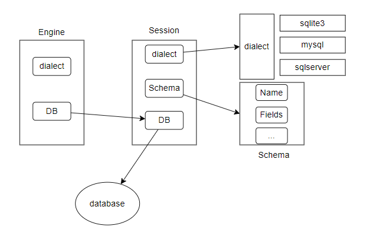

day02 表结构映射


## 一、dialect

方言。对于不同厂商的数据库产品，都有自己独特的部分。

在框架层面抹平所有数据库产品之间的差异

```go
package dialect

import "reflect"

// dialectsMap 维护一个全局的方言数据
var dialectsMap = map[string]Dialect{}

// Dialect 方言接口
// 在框架层面处理各个数据库产品之间的差异
type Dialect interface {
	// DataTypeOf 将Go中的数据类型转换成SQL中的数据类型
	DataTypeOf(typ reflect.Value) string
	// TableExistSQL 判断当前表是否以存在于数据库中
	TableExistSQL(tableName string) (string, []any)
}

// RegisterDialect 注册数据库
func RegisterDialect(name string, dialect Dialect) {
	dialectsMap[name] = dialect
}

// GetDialect 获取数据库
func GetDialect(name string) (Dialect, bool) {
	dialect, ok := dialectsMap[name]
	return dialect, ok
}
```

提供一个SQLite3的实现

```go
package dialect

import (
	"fmt"
	"reflect"
	"time"
)

const (
	DriverName string = "sqlite3"
)

type sqlite3 struct{}

func init() {
	RegisterDialect(DriverName, &sqlite3{})
}

// DataTypeOf 将Go中的数据类型和SQL中的数据里的数据类型进行转换
func (s *sqlite3) DataTypeOf(typ reflect.Value) string {
	for typ.Kind() == reflect.Pointer {
		typ = typ.Elem()
	}
	switch typ.Kind() {
	case reflect.Bool:
		return "bool"
	case reflect.Int, reflect.Int8, reflect.Int16, reflect.Int32, reflect.Uint, reflect.Uint8, reflect.Uint16, reflect.Uint32, reflect.Uintptr:
		return "integer"
	case reflect.Int64, reflect.Uint64:
		return "bigint"
	case reflect.String:
		return "text"
	case reflect.Array, reflect.Slice:
		return "blob"
	case reflect.Struct:
		if _, ok := typ.Interface().(time.Time); ok {
			return "datetime"
		}
	}
	panic(fmt.Sprintf("invalid sql type %s (%s)", typ.Type().Name(), typ.Kind()))
}

// TableExistSQL 判断表是个否存在
func (s *sqlite3) TableExistSQL(tableName string) (string, []any) {
	args := []any{tableName}
	return "SELECT `name` FROM `sqlite_master` WHERE `type` = 'table' AND `name` = ?", args
}

var _ Dialect = (*sqlite3)(nil)

```

SQLite3的`DataTypeOf`方法其实不太好，定死了只能转一些基本的Go中的数据类型

- 指针不支持
- 嵌套结构体不支持【这个好像也确实是不需要支持】
- 自定义的字段不支持

## 二、schema

这就是Go中结构体的元数据信息

- `Schema`是表模型
- `Field`是字段信息

```go
package schema

import (
	"github.com/borntodie-new/neo-orm/day02/dialect"
	"reflect"
)

// Field 字段元信息
// 结构体上的每个字段的信息
type Field struct {
	// Name 字段名，Go中的名字
	Name string
	// Type 字段类型，Go中的类型
	Type string
	// Tag 字段的标签
	Tag string
}

// Schema 表模型——表的元数据信息
type Schema struct {
	// Model 当前结构体的类型
	Model any
	// Name 当前结构体的名字
	Name string
	// Fields 当前结构体中所有的字段
	Fields []*Field
	// FieldNames 当前结构体中的所有的字段的名字
	FieldNames []string
	// FieldMap 将Fields和FieldNames两者进行组合
	FieldMap map[string]*Field
}

// Parse 将结构体解析成表模型元数据
// dest 必须是结构体，不能是指针
func Parse(dest any, d dialect.Dialect) *Schema {
	modelType := reflect.Indirect(reflect.ValueOf(dest)).Type()
	schema := &Schema{
		Model:    modelType,
		Name:     modelType.Name(),
		FieldMap: make(map[string]*Field),
	}
	for i := 0; i < modelType.NumField(); i++ {
		fd := modelType.Field(i)

		if !fd.Anonymous && fd.IsExported() {
			field := &Field{
				Name: fd.Name,
				Type: d.DataTypeOf(reflect.Indirect(reflect.New(fd.Type))),
			}
			if v, ok := fd.Tag.Lookup("neoorm"); ok {
				field.Tag = v
			}
			// 添加字段信息
			schema.Fields = append(schema.Fields, field)
			// 添加字段名
			schema.FieldNames = append(schema.FieldNames, fd.Name)
			// 添加map信息
			schema.FieldMap[fd.Name] = field
		}
	}
	return schema
}
```

这里面有两个点比较有意思

1. `reflect.Indirect`方法

```go
package reflect

// Indirect returns the value that v points to.
// If v is a nil pointer, Indirect returns a zero Value.
// If v is not a pointer, Indirect returns v.
func Indirect(v Value) Value {
	if v.Kind() != Pointer {
		return v
	}
	return v.Elem()
}
```

我们可以看到

- 它的参数如果是一个指针类型，他会将这个指针类型最终所指向的结构体找到
- 如果是一个非指针类型，他会将这个参数正常返回

2. `ast.IsExported(fd.Name)`

兔兔的代码中使用的是AST抽象语法树来判断该字段是否是向外暴露的，
其实我们完全可以使用`fd.IsExported()`方法判断

3. 这里又设计到抽象语法树的概念，大家自行百度即可

## 三、Session

Session部分改动不大，新增了些属性字段，我们在之前说过了，Session的概念是和database进行交互，
所以他内部不用

- 内部必须维护一个表模型：需要将GO类型和SQL类型进行转换
- 内部必须维护一个dialect：因为我们不清楚developer到底是使用按个SQL产品，所以需要维护一个dialect

```go
package session

func (s *Session) Model(value interface{}) *Session {
	// nil or different model, update refTable
	if s.refTable == nil || reflect.TypeOf(value) != reflect.TypeOf(s.refTable.Model) {
		s.refTable = schema.Parse(value, s.dialect)
	}
	return s
}

func (s *Session) RefTable() *schema.Schema {
	if s.refTable == nil {
		log.Error("Model is not set")
	}
	return s.refTable
}
func (s *Session) CreateTable(ctx context.Context) error {
	table := s.RefTable()
	var columns []string
	for _, field := range table.Fields {
		columns = append(columns, fmt.Sprintf("%s %s %s", field.Name, field.Type, field.Tag))
	}
	desc := strings.Join(columns, ", ")
	_, err := s.Raw(fmt.Sprintf("CREATE TABLE %s (%s)", table.Name, desc)).ExecContext(ctx)
	return err
}

func (s *Session) DropTable(ctx context.Context) error {
	_, err := s.Raw(fmt.Sprintf("DROP TABLE IF EXISTS %s", s.refTable.Name)).ExecContext(ctx)
	return err
}

func (s *Session) HasTable(ctx context.Context) bool {
	sql, values := s.dialect.TableExistSQL(s.refTable.Name)
	raw := s.Raw(sql, values...).QueryRowContext(ctx)
	var temp string
	_ = raw.Scan(&temp)
	return temp == s.RefTable().Name
}

```

重点是新增了上述几个方法

- `Model`：注册表模型。其实也不能完全说是注册表模型，如果Session的Model属性没有值，就直接注册
- `RefTable`：获取表模型
- 其他的方法就没什么好说的

## 四、Engine

Engine这边就真没什么更新的东西了，新增了一个dialect属性。

一般来说，维护了一个`sql.DB`就需要维护一个dialect对象

## 总结



1. Engine中的维护的`sql.DB`和`dialect`是为了初始化Session，
   意思就是Engine中的这两个属性完全就是一个中间变量
2. Session中有三个和SQL交互的方法
    - `ExecContext`：执行SQL
    - `QueryRowContext`：查询单挑SQL
    - `QueryRowsContext`：查询多条SQL
3. dialect是抹去各个SQL产品之间的差异
4. schema是记录表模型信息